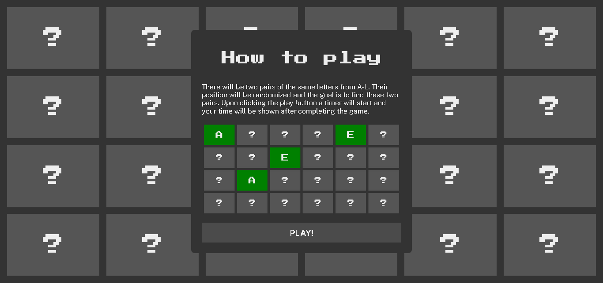

# memory-game

Just a random personal project made with HTML, CSS, and Javascript.

### Preview

### Links

- Live Demo: [https://nevz9.github.io/memory-game/](https://nevz9.github.io/memory-game/)

### Built with

- HTML5 and CSS3
- Javascript DOM Manipulation
- Flexbox
- CSS Grid

### What I've learned

- IIFE Module Pattern
- DOM Manipulation
- More about <i><b>this</b></i> (hopefully)
- Fisher-Yates Shuffle

###

This definitely needs a refactor :(
